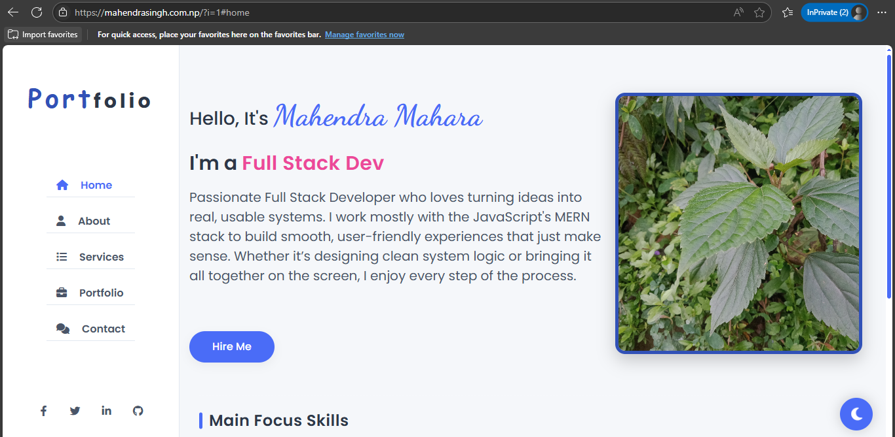
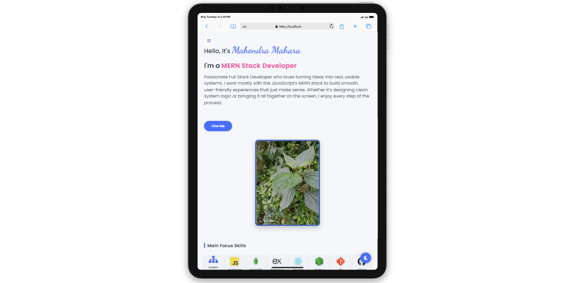
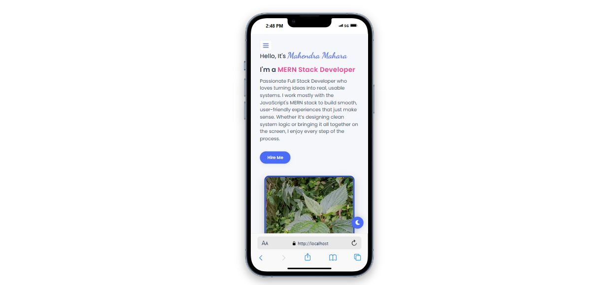

# Mahendra Mahara - Portfolio Website


A modern, responsive portfolio website showcasing my skills, projects, and professional experience as a Full Stack Developer specializing in MERN stack technologies.

**Live Demo:** [https://www.mahendrasingh.com.np](https://www.mahendrasingh.com.np)

## 📱 Responsive Design

<div align="center">
  <table>
    <tr>
      <td align="center"><b>Desktop View</b></td>
      <td align="center"><b>Tablet View</b></td>
      <td align="center"><b>Mobile View</b></td>
    </tr>
    <tr>
      <td></td>
      <td></td>
      <td></td>
    </tr>
  </table>
</div>

## ✨ Features

- **Responsive Design**: Seamlessly adapts to all device sizes (mobile, tablet, desktop)
- **Dark/Light Theme Toggle**: User preference saved via localStorage
- **Interactive UI Elements**: Smooth transitions, animations, and scroll effects
- **Dynamic Content**: Typing animation, animated skill bars and more
- **Section Navigation**: Smooth scrolling between different sections
- **Contact Form**: Direct email functionality via mailto protocol
- **Project Showcase**: Grid layout with project details and technology tags
- **Performance Optimized**: Fast loading with efficient CSS and JS
- **Browser Tab Visibility Handling**: Prevents white screen issue when returning to tab
- **Cross-Browser Compatible**: Works on all modern browsers

## 🛠️ Technologies Used

- **Frontend**: HTML5, CSS3, JavaScript (ES6+)
- **CSS Architecture**: Custom CSS variables for theming
- **Animations**: CSS transitions and keyframes, JS for typing effect
- **Icons**: FontAwesome 6
- **Fonts**: Google Fonts (Poppins, Playfair Display, Dancing Script)
- **Version Control**: Git and GitHub
- **Deployment**: Custom server deployment

## 🚀 Key Sections

1. **Home**: Introduction with typing animation and focus skills
2. **About**: Personal information, education, experience, and skills
3. **Services**: Services offered with interactive cards
4. **Portfolio**: Projects showcase with descriptions and technologies used
5. **Contact**: Contact form and alternative contact methods

## 🧰 Skills Showcase

The portfolio highlights my expertise in:

- **Frontend Development**: React, JavaScript, HTML/CSS
- **Backend Development**: Node.js, Express, MongoDB
- **System Design**: Architecture planning and implementation
- **Tools & Technologies**: Git, Docker, TypeScript
- **Additional Skills**: PHP, Java, C# (ASP.NET), Python, and more

## 📋 Installation & Usage

1. **Clone the repository**
   ```bash
   git clone https://github.com/mahendramahara/My-Portfolio-Web.git
   ```

2. **Navigate to the project directory**
   ```bash
   cd My-Portfolio-Web
   ```

3. **Open in your preferred server or use PHP built-in server**
   ```bash
   php -S localhost:8000
   ```

4. **Open your browser and visit**
   ```
   http://localhost:8000
   ```

## 🔧 Customization

1. **Personal Information**: Update content in `index.php`
2. **Theme Colors**: Modify CSS variables in `css/style.css`
3. **Projects**: Add your projects in the portfolio section
4. **Images**: Replace images in `uploads/` directory
5. **Resume**: Update your resume in `uploads/cv/`

## 🤝 Support

If you have any questions or need assistance with this template, feel free to reach out:

- **Email**: [mahendramahara369@gmail.com](mailto:mahendramahara369@gmail.com)
- **GitHub**: [github.com/mahendramahara](https://github.com/mahendramahara)
- **LinkedIn**: [linkedin.com/in/mahendramahara](https://linkedin.com/in/mahendramahara)

## 📜 License

This project is licensed under the MIT License - see the [LICENSE](LICENSE) file for details.

---

<div align="center">
  <p>⭐ Don't forget to star this repo if you found it useful! ⭐</p>
  
  <p>Designed and developed with ❤️ by Mahendra Mahara © 2025</p>
</div>
